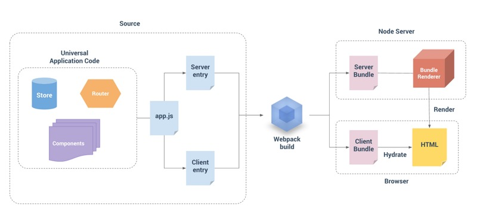

## Vue 服务端渲染

概念: 放在浏览器进行的是浏览器渲染, 放在服务器进行的就是服务端渲染
传统的 `ssr` 方案(`java+jsp php+smarty`)
当前流行 (`node + vue 或 react`)

- 客户端渲染不利于`SEO`搜索引擎优化
- 服务端渲染是可以被爬虫爬取到的, 客户端异步渲染很难被爬虫爬到
- `SSR`直接将`HTML`字符串传递给浏览器. 大大加快了首屏加载时间
- `SSR`要占用更多服务器的`CPU`和内存资源
- 一些常用的浏览器`API`可能无法正常使用
- `Vue`中仅支持`beforeCreate`和`created`两个生命周期

